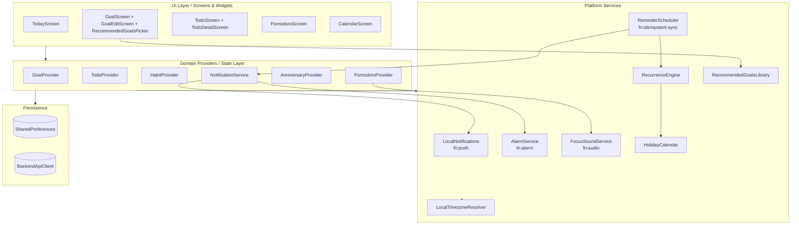
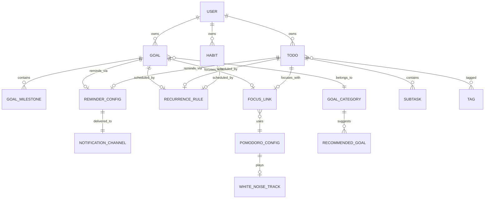
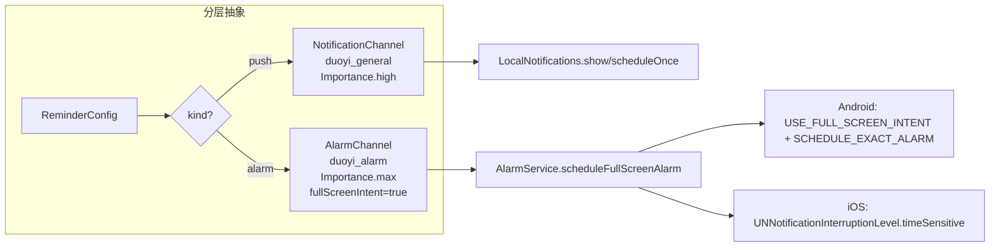
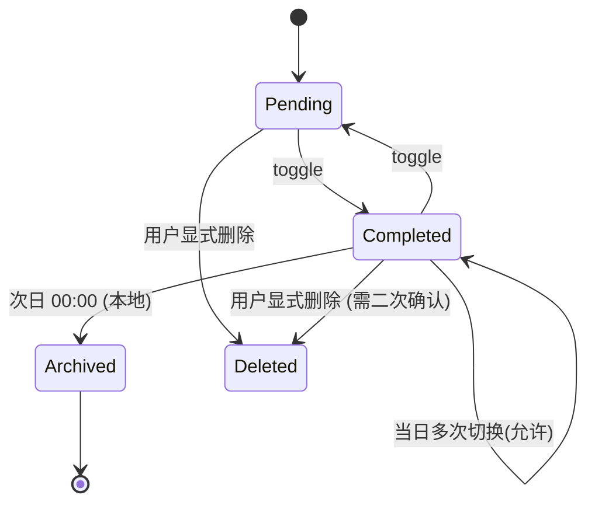
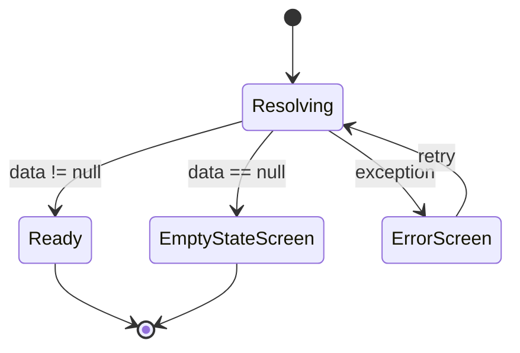

# Design Document: App Alignment Overhaul（指尖时光对齐打磨）

> 本次设计同时包含 **高层设计（架构/数据模型/分层/时区策略）** 与 **低层设计（关键类、函数签名、算法伪代码、UI 状态机）**。
> 代码采用项目现有语言 **Dart / Flutter**；算法层用 `pascal` 伪代码描述以语言无关地表达流程；数据结构图用 `mermaid`。

---

## 1. Overview

"指尖时光（duoyi）"当前处于"毛坯房中的毛坯房"阶段：目标模块字段不完整、任务模块缺关键生产力字段、今日详情页跳转黑屏、通知/提醒语义混乱、专注模式白噪音是假的、大量假数据与空架子界面、时区实现不统一。

本 spec 的目标是一轮**整体对齐（Alignment）+ 打磨（Polish）**：

- 把目标/任务两条主线补齐到"真正可用"的产品层级字段与交互；
- 统一"推送通知（Push Notification）"与"闹钟级提醒（Alarm Reminder）"两条通道；
- 把专注模式白噪音从"假开关"变成"真实音频循环播放 + 后台可控"；
- 把空架子、黑屏、假数据逐一清点与补齐；
- 把时区全面切到**设备本地时区**（`flutter_timezone` + `timezone` 包）；
- 以"完成不销毁、用颜色区分"的方式重构完成态显示；
- 视觉/交互/空态/异常态做一轮系统打磨。

---

## 2. High-Level Design

### 2.1 应用分层架构



**设计要点**：

1. **Domain（Provider）** 永远不直接触碰平台 channel；平台能力封装在 `services/` 下。
2. **Services** 按能力正交拆分：`LocalNotifications`（静默推送）、`AlarmService`（高优闹钟）、`FocusSoundService`（音频）、`RecurrenceEngine`（重复/派发）、`HolidayCalendar`（节假日）、`LocalTimezoneResolver`（时区）。
3. **ReminderScheduler** 是协调器：订阅 Provider 数据变化，做**幂等同步**：先取消自己管过的 id，再重放最新调度。

### 2.2 领域数据模型 ER 图



### 2.3 模块拆分 & 本 spec 涉及面

| 方向 | 模块 | 主要变更 |
| --- | --- | --- |
| A | Goal 模块 | 新增 `GoalCategory`、扩展 `GoalItem` 字段；新增 `RecommendedGoalsLibrary`、`GoalEditScreen` 分模块编辑 |
| B | Todo 模块 | `TodoItem` 扩展：`focusLink`、`postponeHistory`、`hasTimeTarget`、`timeTargetSeconds`、`saveStayBehavior`；`TodoDetailScreen` 保存不返回 |
| C | 完成态保留 | `CompletionVisibilityPolicy`：当日完成任务保留、仅视觉区分；次日零点才淡出 |
| D | 通知 & 提醒 | 抽 `NotificationChannel` / `AlarmChannel` 两类，严格分层：push 用于"消息"，alarm 用于"一定要处理" |
| E | 白噪音 | 新增 `FocusSoundService`，真实 `audioplayers` 播放、前后台生命周期 |
| F | Today 详情路由 | 修复 `TodayDetailRouter`、空数据 fallback、参数校验 |
| G | 视图交互 | `CalendarMonthGrid` 支持 onTap(day) 过滤当日条目；样式统一 token |
| H | 空架子扫描 | `EmptySurfaceAuditor`：静态扫描 + 运行时报告 |
| I | 时区 | `LocalTimezoneResolver` 统一源，所有 `tz.TZDateTime.from(.., tz.local)` |
| J | 视觉打磨 | `DesignTokens`、`EmptyState` / `LoadingState` / `ErrorState` 三件套组件化 |

### 2.4 通知 vs 提醒分层



**硬约束**：

- 所有用户感知为"通知"的入口（如：番茄钟结束、纪念日前 N 天、积分解锁）→ 走 `NotificationChannel`（push，系统通知中心）。
- 所有用户感知为"提醒 / 闹钟 / 到点必须处理"的入口（如：任务到期提醒、目标定时派发、习惯打卡闹钟）→ 走 `AlarmChannel`（alarm，全屏/震动/高优）。
- **禁止** toast / inApp dialog 作为"提醒"的最终落地形式。inApp 仅作为同设备前台时的**镜像**。

### 2.5 时区策略

1. 启动流程在 `main.dart` 首屏前调用 `LocalTimezoneResolver.init()`，内部：
   - 调用 `flutter_timezone.FlutterTimezone.getLocalTimezone()` 拿到 **IANA 名**（例：`Asia/Shanghai`）；
   - `tz.setLocalLocation(tz.getLocation(name))`；
   - 失败回退：使用 `DateTime.now().timeZoneName` / 再失败使用 `tz.getLocation('Asia/Shanghai')`（对中文用户更安全，而不是 UTC）。
2. **任何**涉及"什么时候响"的逻辑，统一写作：`tz.TZDateTime.from(dateTime, tz.local)`。
3. **不得**直接做 `DateTime.utc(...)` 调度。
4. 用户切换设备时区后，下一次 `AppLifecycle.resumed` 重新探测，如变化则：
   - 重新 `setLocalLocation`；
   - 调用 `ReminderScheduler.resyncAll()`。

### 2.6 离线 / 后端接口契约

项目当前以 `SharedPreferences` 做本地存储，`backend/main.py` 提供后端。本设计采用 **Offline-First + 同步回写**：

```
本地写入 → Provider 持久化到 SharedPreferences → CloudSync 排队 → ApiClient push
```

对齐接口契约（JSON Schema 片段）：

```jsonc
// POST /api/v1/goals  -- 创建/更新目标
{
  "id": "uuid",
  "title": "string",
  "category": "recommend|health|study|sport|emotion",
  "icon": "string",
  "colorValue": 0xFFxxxxxx,
  "recurrence": { "frequency": "weekly", "interval": 1, "byWeekdays": [0,2,4] },
  "scheduling": { "mode": "fixed|random", "randomWindow": { "minGapDays": 1 } },
  "skipHolidays": true,
  "focus": { "enabled": true, "preset": "pomodoro25", "sound": "rain" },
  "reminder": { "kind": "alarm|push", "time": "HH:mm", "daysBefore": 0 },
  "timeTargetSeconds": 1800,
  "dailyTargetCount": 2
}
```

- **所有 ID** 统一 UUID v4；
- **所有时间**：请求体里使用本地时区的 `DateTime.toLocal().toIso8601String()`，并额外携带 `tz: "Asia/Shanghai"` 字段给后端做规范化；
- 服务器**只存 UTC + tz 名**，渲染时客户端再转回本地。

### 2.7 完成态保留策略



- 今日列表物理上**不移除** `Completed`；
- 完成后渲染状态：灰字 + 删除线 + `CompletedBadge(color=green.shade400)`；
- 次日 00:00 批处理（`DailyRollover`）把 `Completed` 转为 `Archived`，从今日主列表淡出，但仍可在"历史 / 统计"中查询；
- 物理删除只由用户显式操作（长按/滑动二次确认），不能由"完成"触发。

---

## 3. Low-Level Design

### 3.1 Goal 模型扩展

```dart
// lib/models/goal.dart
enum GoalCategory { recommend, health, study, sport, emotion, custom }

enum SchedulingMode { fixed, random }

class GoalScheduling {
  final SchedulingMode mode;            // fixed | random
  final List<int>? fixedWeekdays;       // mode=fixed & frequency=weekly 时使用 (0..6, 周一=0)
  final List<int>? fixedMonthDays;      // mode=fixed & frequency=monthly 时使用 (1..31)
  final int? randomMinGapDays;          // mode=random 时的最小间隔
  final int? randomMaxPerWeek;          // mode=random 时每周上限
  final int? randomMaxPerMonth;         // mode=random 时每月上限

  const GoalScheduling({ /* ... */ });
}

class ReminderConfig {
  final bool enabled;
  final ReminderKind kind;   // push | alarm
  final int? hour;           // 0..23，本地时区
  final int? minute;         // 0..59
  final int daysBefore;      // 用于 anniversary / target date 类
  final bool vibrate;
  final bool fullScreen;     // 仅 alarm 有意义

  const ReminderConfig({ /* ... */ });
}

enum ReminderKind { push, alarm }

class FocusLink {
  final bool enabled;
  final String? presetId;     // e.g. "pomodoro25", "custom"
  final int? focusSeconds;
  final String whiteNoise;    // 'none' | 'rain' | 'forest' | ...
  const FocusLink({ /* ... */ });
}

class GoalItem {
  // 既有：id, title, description, colorValue, startDate, targetDate,
  //       status, progress, autoProgress, milestones, sortOrder, createdAt, updatedAt
  // 新增：
  GoalCategory category;             // 替代原 String? category
  String icon;                       // 已有；扩展为 MaterialIcons 名或 assets key
  RecurrenceRule recurrence;         // 已有模型，引入
  GoalScheduling scheduling;         // 定期 / 随机
  bool skipHolidays;                 // 跳过节假日
  FocusLink focusLink;               // 专注模式联动
  ReminderConfig reminder;           // 闹钟提醒
  int? timeTargetSeconds;            // 目标时间（分钟 * 60）
  int? dailyTargetCount;             // 每日完成次数
}
```

### 3.2 Todo 模型扩展

```dart
// lib/models/todo.dart 额外字段
class TodoItem {
  // 既有字段不动
  FocusLink focusLink;                 // 新增：专注联动
  ReminderConfig reminder;             // 新增：替代 hasReminder + reminderAt
  int? timeTargetSeconds;              // 新增：目标时间
  List<PostponeRecord> postponeHistory;// 新增：顺延历史
  // 新增：用于 UI "保存不返回" —— 模型本身不持久，交互层状态
}

class PostponeRecord {
  final DateTime from;
  final DateTime to;
  final String reason;   // "manual" | "auto_daily_rollover"
  final DateTime at;
}
```

### 3.3 RecommendedGoalsLibrary

```dart
// lib/core/recommended_goals.dart
class RecommendedGoal {
  final String id;
  final GoalCategory category;
  final String title;
  final String description;
  final String icon;
  final int colorValue;
  final RecurrenceRule recurrence;
  final GoalScheduling scheduling;
  final bool skipHolidays;
  final FocusLink focusLink;
  final ReminderConfig reminder;
  final int? timeTargetSeconds;
  final int? dailyTargetCount;
}

class RecommendedGoalsLibrary {
  // 5 大类 × 每类 5~8 条，共 ~30 条
  static List<RecommendedGoal> all();
  static List<RecommendedGoal> byCategory(GoalCategory c);

  /// 将 RecommendedGoal 实例化为用户自己的 GoalItem（生成新 UUID）
  static GoalItem instantiate(RecommendedGoal r);
}
```

### 3.4 RecurrenceEngine（核心算法）

```dart
// lib/services/recurrence_engine.dart
abstract class RecurrenceEngine {
  /// 给定 rule + scheduling + skipHolidays + anchor, 返回下一个触发日。
  /// 保证：返回值在本地时区下是一个"日"对齐的 DateTime(year, month, day)。
  DateTime? nextOccurrence({
    required RecurrenceRule rule,
    required GoalScheduling scheduling,
    required bool skipHolidays,
    required DateTime anchor,   // 上一次执行/生成日期
    DateTime? now,              // 注入 now 便于测试
  });

  /// 枚举 [start, end] 区间内所有触发日（含端点），用于日历展示。
  List<DateTime> enumerateOccurrences({
    required RecurrenceRule rule,
    required GoalScheduling scheduling,
    required bool skipHolidays,
    required DateTime start,
    required DateTime end,
  });
}
```

**周/月随机派发 + 跳过节假日 伪代码**：

```pascal
ALGORITHM nextOccurrence(rule, scheduling, skipHolidays, anchor, now)
INPUT : rule(RecurrenceRule), scheduling(GoalScheduling),
        skipHolidays(bool), anchor(DateTime), now(DateTime)
OUTPUT: DateTime or NULL

BEGIN
  IF rule.frequency = none THEN RETURN NULL

  candidate ← NULL

  IF scheduling.mode = fixed THEN
    candidate ← rule.nextAfter(anchor)           // 既有 weekly/monthly/daily/yearly 基础算法
    // 若 frequency=weekly 且 fixedWeekdays 非空, 由既有 byWeekdays 分支处理
    // 若 frequency=monthly 且 fixedMonthDays 非空, 迭代至最近一个符合日
  ELSE IF scheduling.mode = random THEN
    // 周随机：[anchor+minGap, anchor+7*interval] 内均匀采样一个"工作 day"
    lowerBound ← anchor + max(1, scheduling.randomMinGapDays)
    upperBound ←
      IF rule.frequency = weekly THEN anchor + 7 * rule.interval
      ELSE IF rule.frequency = monthly THEN endOfMonth(anchor + rule.interval months)
      ELSE anchor + rule.interval days
    candidate ← uniformRandomDayIn(lowerBound, upperBound,
                                   seed = stableSeed(goalId, yearWeek(lowerBound)))
  END IF

  // 跳过节假日
  IF skipHolidays THEN
    WHILE HolidayCalendar.isHoliday(candidate) DO
      candidate ← candidate + 1 day
      // 若随机窗口上限也被跨越, 回落到窗口内最后一个非节假日
      IF candidate > upperBound THEN
        candidate ← lastNonHolidayBefore(upperBound)
        BREAK
      END IF
    END WHILE
  END IF

  IF rule.endDate ≠ NULL AND candidate > rule.endDate THEN RETURN NULL

  RETURN candidate
END
```

> **稳定种子**：`stableSeed(goalId, yearWeek(...))` 保证同一个 goal 在同一周内多次计算得到同一个"随机日"，避免 UI 每次刷新都飘。

**顺延算法**（把未完成的今日 todo 推到明日）：

```pascal
ALGORITHM postponeOverdue(todos, today)
INPUT : todos(List<TodoItem>), today(DateTime, 本地 00:00)
OUTPUT: void (副作用：修改 todos)

BEGIN
  FOR each t IN todos DO
    IF t.isCompleted THEN CONTINUE
    IF t.dueDate = NULL THEN CONTINUE
    IF dateOnly(t.dueDate) ≥ today THEN CONTINUE   // 未到期
    // 顺延一天
    prevDue ← t.dueDate
    newDue  ← dateOnly(today)
      .copyWith(hour=prevDue.hour, minute=prevDue.minute)
    t.postponeHistory.add({
      from: prevDue, to: newDue,
      reason: 'auto_daily_rollover', at: now
    })
    t.dueDate ← newDue
    IF t.reminder.enabled THEN
      t.reminder.scheduledAt ← newDue   // 触发 ReminderScheduler 重同步
    END IF
  END FOR
END
```

**子任务聚合完成度 + 父任务联动**：

```pascal
ALGORITHM recomputeParentCompletion(parent)
INPUT : parent(TodoItem)
OUTPUT: void (副作用)

BEGIN
  IF parent.subtasks IS EMPTY THEN
    // progress 由父自身 isCompleted 决定
    progress ← parent.isCompleted ? 1.0 : 0.0
  ELSE
    done  ← count(s ∈ parent.subtasks where s.isCompleted)
    total ← count(parent.subtasks)
    progress ← done / total
  END IF

  parent.subtaskProgress ← progress
  IF progress = 1.0 AND NOT parent.isCompleted THEN
    parent.isCompleted ← TRUE
    parent.completedAt ← now()
  ELSE IF progress < 1.0 AND parent.isCompleted AND parent.autoToggleByChildren THEN
    parent.isCompleted ← FALSE
    parent.completedAt ← NULL
  END IF
END
```

### 3.5 ReminderScheduler（幂等协调器，扩展现有）

```dart
// lib/services/reminder_scheduler.dart（增强版）
class ReminderScheduler {
  Future<void> syncTodos(Iterable<TodoItem> todos);
  Future<void> syncHabits(Iterable<Habit> habits);
  Future<void> syncAnniversaries(Iterable<Anniversary> items);
  Future<void> syncGoals(Iterable<GoalItem> goals);         // 新增

  /// 在时区变化、权限变化、应用冷启动时整轮重放。
  Future<void> resyncAll({
    required Iterable<TodoItem> todos,
    required Iterable<Habit> habits,
    required Iterable<Anniversary> annis,
    required Iterable<GoalItem> goals,
  });

  /// 路由到 push / alarm：
  Future<void> _dispatch(ReminderConfig r, _Payload p) {
    switch (r.kind) {
      case ReminderKind.push:  return LocalNotifications.instance.scheduleOnce(...);
      case ReminderKind.alarm: return AlarmService.instance.scheduleFullScreen(...);
    }
  }
}
```

### 3.6 AlarmService（新增，与 LocalNotifications 平行）

```dart
// lib/services/alarm_service.dart
class AlarmService {
  static final AlarmService instance = AlarmService._();
  AlarmService._();

  Future<void> init();

  /// Android：channel=duoyi_alarm, Importance.max, fullScreenIntent=true,
  ///          category=alarm, vibrate=[0,500,500,500]
  /// iOS：   interruptionLevel=.timeSensitive / .critical（需特殊权限）
  Future<void> scheduleFullScreen({
    required int id,
    required String title,
    required String body,
    required DateTime when,       // 本地时区 DateTime
    String? payload,
    bool requireExactAlarm = true,
  });

  Future<void> cancel(int id);
  Future<void> cancelAll();

  /// Android 12+ 精准闹钟权限
  Future<bool> requestExactAlarmPermission();
}
```

### 3.7 FocusSoundService（真实白噪音）

资产约定：

```
assets/sounds/white_noise/
  rain.mp3
  forest.mp3
  cafe.mp3
  waves.mp3
```

pubspec.yaml 新增 `audioplayers: ^6.x`，并把目录加入 `flutter.assets`。

```dart
// lib/services/focus_sound_service.dart
class FocusSoundService {
  static final FocusSoundService instance = FocusSoundService._();
  FocusSoundService._();

  /// 当前正在播放的音轨 id（'none' 表示未播）
  String get currentSound;
  bool get isPlaying;
  double get volume;

  /// 切换音轨；传入 'none' 等价于 stop()
  Future<void> play(String sound);
  Future<void> stop();
  Future<void> setVolume(double v); // 0..1
  Future<void> fadeOut(Duration d);
  Future<void> fadeIn(Duration d);

  /// 前后台切换：
  /// - onBackground(): 保持播放（Android: foregroundService or mediaSession）
  /// - onForeground(): 无需动作
  void bindLifecycle(WidgetsBinding binding);

  void dispose();
}
```

**关键行为**：

- 使用 `AudioPlayer` + `ReleaseMode.loop` + `PlayerMode.lowLatency`；
- 番茄钟 focus 开始 → `FocusSoundService.play(state.whiteNoiseSound)`；
- focus 暂停 → `fadeOut(300ms)` 后 stop；
- break 阶段 → 按 `config.playSoundInBreak` 决定是否继续；
- `resumeApp` 时根据 `PomodoroState.isRunning` 恢复；
- Android 需 `ForegroundServiceType = mediaPlayback`，否则锁屏被 kill。

### 3.8 Today 详情路由修复

```dart
// lib/screens/today_detail_router.dart（新增）
class TodayDetailRouter {
  /// 从"今日"各 section 的"查看"按钮统一入口，根据 section 类型跳转。
  /// - 不再把空数据的 section 导向黑屏；
  /// - 任何 404 / 空 id / 数据已删除的情况，都走 EmptyState fallback。
  static void open(BuildContext ctx, TodaySectionKind kind, {String? id});
}

enum TodaySectionKind { todos, courses, anniversaries, goals, habits, diary }
```

**状态机（Today 详情）**：



### 3.9 TodoDetailScreen "保存不返回" 状态机

```mermaid
stateDiagram-v2
  [*] --> Clean
  Clean --> Editing: user edits any field
  Editing --> Saving: tap Save
  Saving --> Clean: persist OK (show inline toast "已保存"; stay on page)
  Saving --> Editing: persist fail (snackbar error, keep dirty)
  Clean --> Navigating: user taps back
  Editing --> ConfirmDiscard: user taps back
  ConfirmDiscard --> Clean: discard
  ConfirmDiscard --> Editing: cancel
  Navigating --> [*]
```



- **Save 只持久化，不 pop**；
- 通过 `AppBar` 的 check 按钮触发；
- 保存成功：页面停留 + Lottie/小动画 + 底部 inline banner；
- "返回"仅由用户显式点击 back 键 / 返回按钮触发；若仍是 dirty 则弹放弃确认框。

### 3.10 完成态可见性策略

```dart
// lib/core/completion_visibility_policy.dart
class CompletionVisibilityPolicy {
  /// 今日列表是否展示该任务
  static bool shouldShowInToday(TodoItem t, DateTime now) {
    final today = DateTime(now.year, now.month, now.day);
    final isToday = _dateOnly(t.date) == today;
    if (!isToday) return false;
    // 已 Archived 次日的不显示
    if (t.isArchivedAfterRollover) return false;
    // 其它包括 Completed 都保留
    return true;
  }

  /// 次日 00:00 的归档批处理
  static Future<void> runDailyRollover(TodoProvider provider, DateTime now);

  /// 可视样式
  static TodoVisualState visualState(TodoItem t) {
    if (t.isCompleted) return TodoVisualState.completed;
    if (t.isOverdue)   return TodoVisualState.overdue;
    if (t.dueDate != null && t.dueDate!.difference(DateTime.now()).inHours < 3) {
      return TodoVisualState.dueSoon;
    }
    return TodoVisualState.normal;
  }
}

enum TodoVisualState { normal, dueSoon, overdue, completed, archived }
```

**颜色 token**（写入 `DesignTokens`）：

| 状态 | 颜色 | 文案处理 |
| --- | --- | --- |
| normal | `onSurface` | 正常 |
| dueSoon | `orange.shade400` | icon.alarm 闪烁 |
| overdue | `red.shade400` | "过期" 徽标 |
| completed | `green.shade400` | 删除线 + 灰度 70% + "已完成"小徽章 |
| archived | `grey.shade400` | 隐藏于今日（统计面板可见） |

### 3.11 日历视图点击日期

```dart
// lib/widgets/calendar_month_grid.dart（增强）
typedef OnDayTap = void Function(DateTime day);

class CalendarMonthGrid extends StatelessWidget {
  final DateTime month;
  final Set<DateTime> daysWithEvents;
  final DateTime? selectedDay;
  final OnDayTap? onDayTap;
  // 被选中的 day 视觉高亮 + 通知父级通过 CalendarProvider 过滤当日事件
}
```

- 父级页面（CalendarScreen）订阅 `selectedDay`，下方列表区展示该日所有 `CalendarEvent / TodoItem / Anniversary / Course` 聚合结果。

### 3.12 空架子扫描方法（EmptySurfaceAuditor）

```dart
// lib/core/empty_surface_auditor.dart
class EmptySurfaceAuditor {
  /// 静态 meta（由人工 + 脚本填入已知占位界面清单）。
  static const List<EmptySurfaceEntry> known = [
    EmptySurfaceEntry(file: 'lib/services/audio_service.dart',
        reason: '_isPlaying 仅是内存标记，未接真实音频'),
    EmptySurfaceEntry(file: 'lib/screens/today_screen.dart',
        reason: '_section 的"查看"按钮对部分类型跳转黑屏'),
    // ...更多
  ];

  /// 运行时探测：遍历已注册 Screen，检查 data = empty 且 UI 只渲染 Text("TODO")。
  static Future<EmptyAuditReport> runtimeAudit(BuildContext ctx);
}

class EmptySurfaceEntry {
  final String file;
  final String reason;
  final String? fixTicketId;
}
```

**扫描方法论（供实现阶段使用）**：

1. `grep` 关键字：`TODO`、`FIXME`、`Placeholder`、`假数据`、`mock`、`hardcoded`；
2. `grep` 函数体只有 `return Container();` / `return const SizedBox();` 的 build 方法；
3. `grep` 声明了但 body 为空的 Future：`async {}`、`Future.value()` 立即返回；
4. 对比 `screens/` 下的路由表，看哪些 screen 被路由但从未被打开过；
5. 把以上清单写入 `docs/empty-surface-audit.md` 作为 tasks 阶段的 backlog。

### 3.13 错误处理与空态策略

```dart
// lib/widgets/result_states.dart
class EmptyState extends StatelessWidget { ... }     // 已有，扩展入参 action
class LoadingState extends StatelessWidget { ... }   // 新增 shimmer
class ErrorState extends StatelessWidget {           // 新增
  final Object error;
  final VoidCallback onRetry;
}

// 统一在 Provider 层暴露 AsyncState<T>：
sealed class AsyncState<T> {
  const AsyncState();
}
class AsyncLoading<T> extends AsyncState<T> {}
class AsyncData<T>    extends AsyncState<T> { final T data; }
class AsyncError<T>   extends AsyncState<T> { final Object e; final StackTrace s; }
```

UI 统一使用：

```dart
Widget build(BuildContext context) {
  final s = context.watch<XProvider>().state;
  return switch (s) {
    AsyncLoading() => const LoadingState(),
    AsyncError(:final e) => ErrorState(error: e, onRetry: ...),
    AsyncData(:final data) => data.isEmpty ? EmptyState(...) : _Content(data),
  };
}
```

### 3.14 关键类/函数签名汇总（一览）

```dart
// Core
class LocalTimezoneResolver {
  static Future<void> init();
  static String get currentIana;
}
class HolidayCalendar {
  bool isHoliday(DateTime day);
  bool isWorkMakeupDay(DateTime day);    // 周末调休上班
}
class DesignTokens { /* colors, radii, spacing */ }

// Goal
class GoalItem { /* 扩展见 3.1 */ }
class GoalProvider extends ChangeNotifier {
  Future<void> loadFromStorage();
  Future<void> add(GoalItem g);
  Future<void> update(GoalItem g);
  Future<void> delete(String id);
  Future<void> applyRecommended(RecommendedGoal r);
  Future<void> onTimezoneChanged();      // 重同步所有提醒
}
class RecommendedGoalsLibrary { /* 见 3.3 */ }

// Todo
class TodoItem { /* 扩展见 3.2 */ }
class TodoProvider extends ChangeNotifier {
  Future<void> postponeOverdue(DateTime today);     // 见算法 3.4
  Future<void> toggleSubtask(String todoId, String subId);
  Future<void> recomputeParent(String todoId);
  Future<void> setReminder(String todoId, ReminderConfig cfg);
  Future<void> startFocus(String todoId);           // 关联 PomodoroProvider
}

// Reminder & Notification
class NotificationService { /* push only */ }
class AlarmService        { /* alarm only，见 3.6 */ }
class ReminderScheduler   { /* 见 3.5，增强 */ }

// Focus sound
class FocusSoundService   { /* 见 3.7 */ }

// Today fix
class TodayDetailRouter   { /* 见 3.8 */ }

// Completion
class CompletionVisibilityPolicy { /* 见 3.10 */ }

// Audit
class EmptySurfaceAuditor { /* 见 3.12 */ }
```

### 3.15 主要算法一览（pascal 汇总）

```pascal
ALGORITHM dailyRollover(now)
  // 每天 00:00 本地触发
  // 1) 归档昨日 Completed
  FOR t IN todos WHERE t.isCompleted AND dateOnly(t.completedAt) < today DO
    t.isArchivedAfterRollover ← TRUE
  END FOR
  // 2) 顺延未完成且已过期
  postponeOverdue(todos, today)
  // 3) 基于 recurrence 生成今日新实例（Habit / Goal 派发）
  materializeTodayFromRecurring(today)
END

ALGORITHM materializeTodayFromRecurring(today)
  FOR g IN goals WHERE g.status = active DO
    next ← RecurrenceEngine.nextOccurrence(g.recurrence, g.scheduling,
                                           g.skipHolidays, g.lastFiredAt ?? g.startDate)
    IF next = today THEN
      CREATE occurrence(goalId=g.id, date=today, dailyTargetCount=g.dailyTargetCount)
      IF g.reminder.enabled THEN
        ReminderScheduler.scheduleFor(g, date=today)
      END IF
    END IF
  END FOR
END
```

---

## 4. Correctness Properties（可做 Property-Based Test 的不变式）

> 以下每条都用"∀ ... ⟹ ..."表达。实现阶段建议使用 `package:glados` 或 `dart:math.Random` 手写 shrinker 覆盖。

### 4.1 时区 / 闹钟

**P1 (Alarm fires at configured local time)**
∀ `ReminderConfig r` with `r.kind = alarm, r.hour = H, r.minute = M`,
∀ 目标触发日 `D`（设备本地时区），
**调度返回的 `tz.TZDateTime`** `T` 满足：
`T.timeZoneName == tz.local.name ∧ T.hour == H ∧ T.minute == M ∧ dateOnly(T) == D`。

**P2 (Timezone change re-sync preserves wall-clock time)**
设备时区由 `tz1` 切至 `tz2` 后，`ReminderScheduler.resyncAll()` 重新调度的闹钟在新时区下的本地时间仍等于用户原设定的 `(H, M)`，即"壁钟时间不变、绝对 UTC 时间改变"。

**P3 (No UTC leak)**
∀ 调度调用，最终传入 `flutter_local_notifications.zonedSchedule` 的 `tz.TZDateTime` 的 `location ≠ tz.UTC`（除非系统时区探测失败的 fallback，且此时必须记录日志）。

### 4.2 完成态保留

**P4 (Today completion non-destructive)**
∀ `TodoItem t`，在当日执行 `toggleTodo(t.id)` 将 `t.isCompleted` 由 `false` 转为 `true` 后：
`t ∈ provider.todos` ∧ `shouldShowInToday(t, now) = true` ∧ `visualState(t) = completed`。

**P5 (Rollover archives only past-day completions)**
∀ 今日 00:00 触发的 `runDailyRollover(now)` 后：
`{t | t.isArchivedAfterRollover = true}` 与 `{t | t.isCompleted ∧ dateOnly(t.completedAt) < today}` 完全相等。

### 4.3 子任务聚合

**P6 (All subtasks done ⇔ parent progress = 100%)**
∀ `TodoItem p` with `p.subtasks ≠ ∅`:
`(∀ s ∈ p.subtasks, s.isCompleted = true) ⟺ (p.subtaskProgress = 1.0)`。

**P7 (Parent auto-completes iff configured)**
∀ `p` with `p.autoToggleByChildren = true` and `p.subtasks ≠ ∅`:
`p.subtaskProgress = 1.0 ⟹ p.isCompleted = true`。
并且反向方向（去勾选任意 subtask）：
`p.subtaskProgress < 1.0 ∧ p.autoToggleByChildren = true ⟹ p.isCompleted = false`。

### 4.4 重复 / 随机 / 节假日

**P8 (Next occurrence respects frequency)**
∀ `rule`, `anchor`：若 `rule.frequency = weekly ∧ interval = k`，则
`next - anchor ≥ 1 day ∧ next - anchor ≤ 7 * k days`。

**P9 (Skip-holiday invariant)**
∀ `goal g` with `g.skipHolidays = true`，`RecurrenceEngine.nextOccurrence(g, anchor)` 返回的 `next` 满足：
`HolidayCalendar.isHoliday(next) = false`（除非整个随机窗口都是节假日，此时应返回 NULL 或窗口内最后一个工作日，由实现选择一致策略并在测试中断言）。

**P10 (Random scheduling stability within same period)**
∀ `goalId g`，∀ 同一"周"内两次计算 `nextOccurrence`：返回的日期相同（由 `stableSeed(g.id, yearWeek)` 保证）。

**P11 (No occurrence past endDate)**
∀ `rule` with `rule.endDate = E`：`nextOccurrence(...) ≠ NULL ⟹ result ≤ E`。

### 4.5 顺延算法

**P12 (Postpone monotonicity)**
∀ overdue todo `t`，`postponeOverdue` 之后：
`t.dueDate ≥ today 00:00 (local) ∧ t.dueDate.hour = prev.hour ∧ t.dueDate.minute = prev.minute`。

**P13 (Postpone idempotency)**
∀ `todos`，`postponeOverdue(postponeOverdue(todos, today), today)` 与 `postponeOverdue(todos, today)` 对每个 `t.dueDate` 的结果相同（除 `postponeHistory` 的追加外）。

### 4.6 通知 vs 闹钟分层

**P14 (Channel routing)**
∀ `ReminderConfig r`：
`r.kind = push  ⟹ 调度调用最终落在 LocalNotifications.scheduleOnce / scheduleDaily`；
`r.kind = alarm ⟹ 调度调用最终落在 AlarmService.scheduleFullScreen` 且使用 `duoyi_alarm` channel。

**P15 (No toast masquerading as reminder)**
在 `lib/` 范围内不存在这样的代码路径：`ReminderConfig.enabled = true` 的触发最终只弹出 `ScaffoldMessenger.showSnackBar` 而不发出系统通知/闹钟。（可通过静态扫描 + 单元测试双重保证）

### 4.7 白噪音真实性

**P16 (Focus sound really plays)**
∀ `PomodoroState s` 转入 `isRunning = true ∧ s.whiteNoiseSound ≠ 'none'` 之后：
`FocusSoundService.isPlaying = true ∧ FocusSoundService.currentSound = s.whiteNoiseSound`。

**P17 (Stop invariants)**
∀ pomodoro pause / reset / complete：`FocusSoundService.isPlaying → false` 在不超过 500ms 内成立（允许 fadeOut）。

### 4.8 保存不返回

**P18 (Save does not pop route)**
∀ `TodoDetailScreen` 的 `save()` 调用：Navigator 栈顶路由在调用前后保持同一路由实例（`ModalRoute.of(context).settings.name` 与 `isCurrent` 均不变）。

### 4.9 完成度与归档一致性

**P19 (Completed implies has completedAt)**
∀ `t`：`t.isCompleted = true ⟹ t.completedAt ≠ null`。

**P20 (Archived implies completed)**
∀ `t`：`t.isArchivedAfterRollover = true ⟹ t.isCompleted = true`。

---

## 5. 实现注意（与工程上下文对齐）

1. `pubspec.yaml` 需新增：
   - `audioplayers: ^6.x`（白噪音）；
   - `flutter_timezone: ^3.x`（时区 IANA 名获取，替代 `DateTime.now().timeZoneName` 不可靠的问题）；
   - `assets/sounds/white_noise/` 目录纳入 assets。
2. Android `AndroidManifest.xml` 需加：
   - `<uses-permission android:name="android.permission.SCHEDULE_EXACT_ALARM"/>`；
   - `<uses-permission android:name="android.permission.USE_FULL_SCREEN_INTENT"/>`；
   - `<uses-permission android:name="android.permission.FOREGROUND_SERVICE"/>`；
   - `<service android:name="..." android:foregroundServiceType="mediaPlayback"/>`（白噪音后台播放）。
3. 既有 `AudioService`（空壳）重命名迁移到 `FocusSoundService`，保留一个 `deprecated` 兼容 shim。
4. `TodayDetailRouter` 替代当前 `today_screen.dart` 中 `onMore` 直接 `Navigator.push` 的写法。
5. `CompletionVisibilityPolicy.runDailyRollover` 通过 `WidgetsBinding.instance.addPostFrameCallback` 在 `AppLifecycleState.resumed` 且日期翻越时触发；同时作为 `main.dart` 冷启动步骤之一。
6. 新增/更新 ER 图中所有模型的 `toJson / fromJson` 必须保持旧数据向后兼容：读取缺失字段使用默认值，写入时补齐。
7. 后端 `backend/main.py` 对齐字段前，客户端先保持本地可用，Backend 契约通过特性开关 `cloud_sync_v2` 分阶段开启。

---

*(文档完)*
